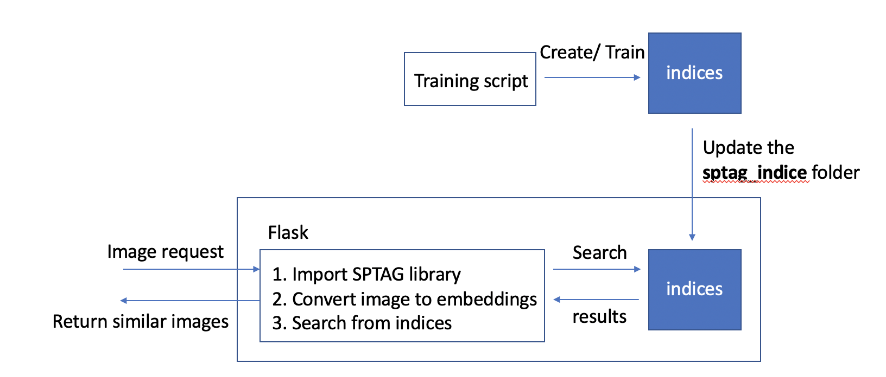
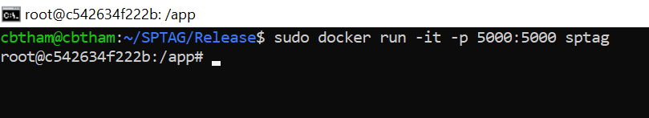
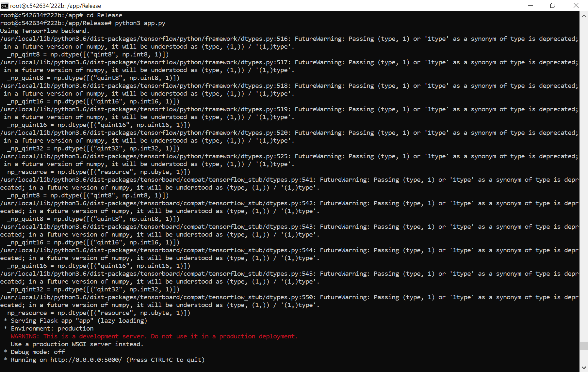
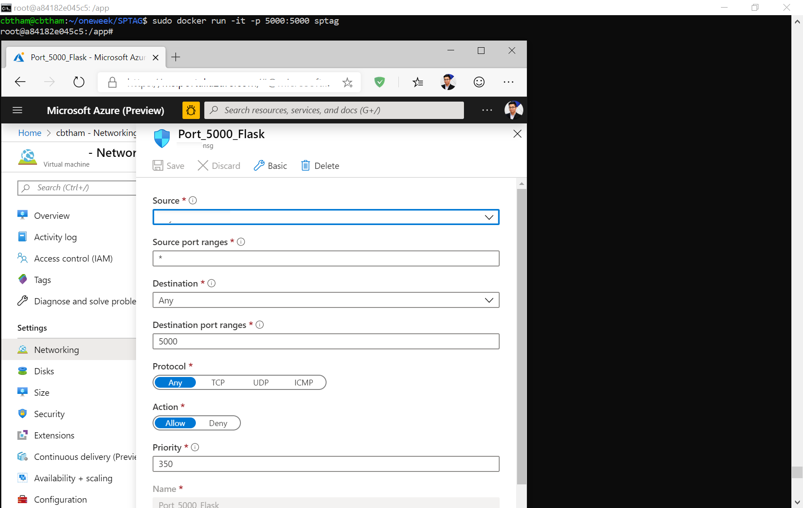
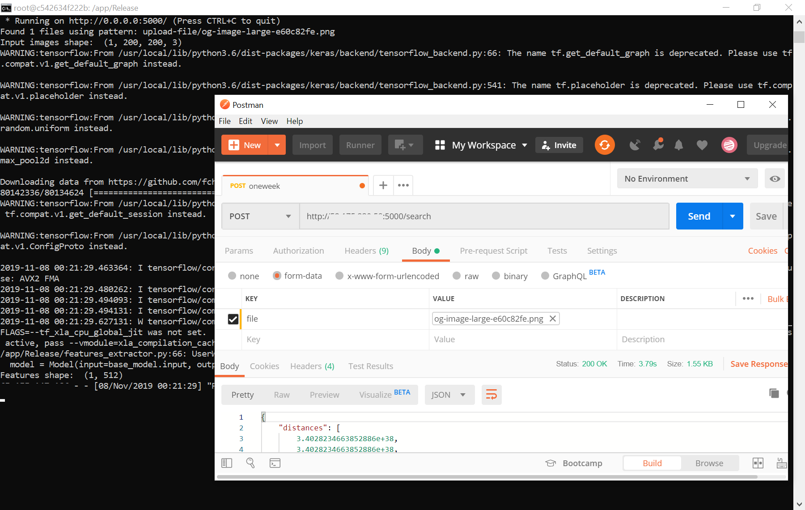

 # Option 1: Running your indexes on distributed servers

This walkthrough assumes you have already run through [this guide]() to generate a sample index with the Caltech 101 image dataset. 

Now we will be setting up the servers, aggregator and client using the Caltech101 index that was created. 

## Setting up a Server
In the Release folder, create a config file and populate it with the following:

```
[Service]
ListenAddr=0.0.0.0
ListenPort=8000
ThreadNumber=8
SocketThreadNumber=8

[QueryConfig]
DefaultMaxResultNumber=6
DefaultSeparator=,

[Index]
List=KDT

[Index_KDT]
IndexFolder=<path-to-your-index-folder>
```

Replace `<path-to-your-index-folder>` with the full path to the index folder which was created (ending with /sptag_indice).
 
Then, run the following command in the Release folder to start the first server:
```
./server --mode socket --config <name-of-your-config-file>
```

Each server you set up can point to a different index - just change the IndexFolder path in your config file. Repeat the same steps to set up a second server (remember to listen on a different port). 

## Setting up the Aggregator
If you wish to aggregate results from multiple servers, then use the aggregator. The client calls the aggregator, and the aggregator will aggregate results from the servers which it points to. In the Release folder, create a config file called **Aggregator.ini**. Note that this .ini file must be named Aggregator.ini, and be in root of the Release folder. 

An example of Aggregator.ini is as follows:
```
[Service]
ListenAddr=0.0.0.0
ListenPort=8100
ThreadNumber=8
SocketThreadNumber=8

[Servers]
Number=2

[Server_0]
Address=127.0.0.1
Port=8000

[Server_1]
Address=127.0.0.1
Port=8001
```

In the config file, you can specify the ports which your servers are running on. 

Then, run the following command to start the aggregator:
```
./aggregator
```

## Setting up the Client

Run the following to start the client:
```
./client --server <server-ip> --port 8100
```
You can use the IP address/port of your aggregator or a single server, depending on your setup. In our case, we are pointing to the aggregator port. 

## Reference

For more options and information on configuring the server, aggregator and client, please refer to the following doc: https://github.com/microsoft/SPTAG/blob/master/docs/GettingStart.md

# Option 2: Running SPTAG in a Flask app

## **Hosting SPTAG with Flask application**
Here we provide a sample alternative to the socket app by hosting a Flask application that does the prediction using SPTAG libraries. 

Below is an high-level diagram that demonstrates the concept:



### **Docker**
Run below command to start the flask app in docker:
```
docker run -it -p 5000:5000 sptag 
```


Then run
```
cd Release
python3 app.py
```


Remember to open port 5000. Below is an example image of how to open port 5000 if you are hosting the app on azure:



### **/sptag_indice**
This is a folder for you to put your indices. Update this folder with your latest indices whenever you train and update your indices.

### **Sample Request**
```
curl -X POST -F 'file=@<path to image>/image_0001.jpg' http://<ip address>:<port>/search
```
You can also send the request through Postman as below:


### **Sample Response**
```json
{
  "distances":[12853.609375,11242.4453134],
  "filenames":["path/image_0031.jpg","path/image_0005.jpg"],
  "idxs":[2236,1110]
}
```
